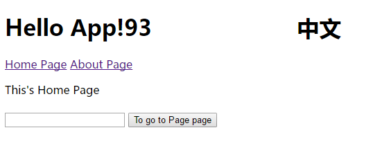

## vue+vue-route+vuex+webpack 一个简单的demo
* app.js 是去vue路由"#"号的方案
* 一个有加减按钮的vuex实例
* 单页面路由跳转
* vuex处理弹窗事件
* vuex处理中英语言


```javascript
npm run hot // webpack-dev-server 开发
npm run build // webpack 打包
```
[Demo](https://leegsen7.github.io/vuex-demo/index.html)